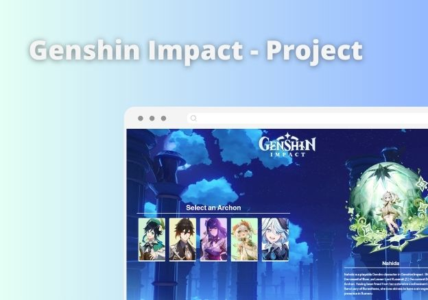

<h1 align="center"> Genshin Impact - Project </h1>

Projeto com o objetivo de praticar meus estudos em programação.  

  <a href="#-tecnologias">Tecnologias</a>&nbsp;&nbsp;&nbsp;|&nbsp;&nbsp;&nbsp;
  <a href="#-projeto">Projeto</a>&nbsp;&nbsp;&nbsp;|&nbsp;&nbsp;&nbsp;

 

  

## 🚀 Tecnologias

Esse projeto foi desenvolvido com as seguintes tecnologias:

- HTML e CSS
- JavaScript
- Git e Github
- Canva

## 💻 Projeto

Genshin Impact Project é uma interface onde podemos visualizar os personagens através do clique.

- [Acesse o projeto finalizado, online](https://bubblesu.github.io/genshin-project/)

---

Feito por Lana R.